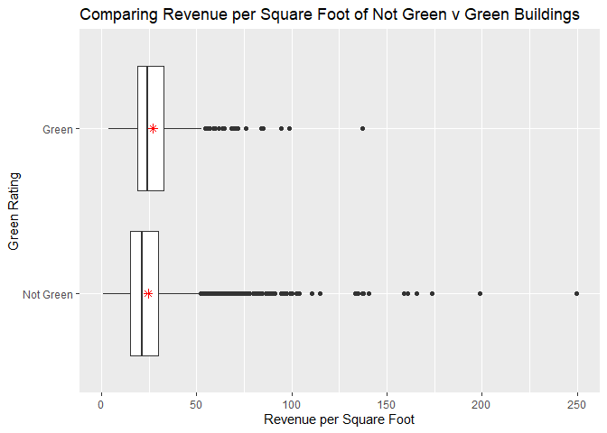

Visual story telling part 1: green buildings
--------------------------------------------

Predicting expected profitability is essential for investments,
especially large capital projects like a $100M 250,000 sq.ft. mixed-use
building. From the initial analysis, it appears that the 5% expected
premium for green certification is a good investment, as costs may be
recovered in less than 8 years.

We see from the graph above that the medians (black lines on the
boxplots) and means (represented by the red stars) of green and
non-green building revenue per square foot are different. The not green
buildings have a mean of $24.50, while the green buildings have a mean
of $27.00. This shows that from both means and medians, there is
additional revenue on average for green buildings.

However, there are a number of issues with the original staff member’s
analysis:

-   The staff member used the median in his analysis rather than the
    mean. While he is correct that the median is more robust to
    outliers, it is important to consider outliers in this analysis.
    Thus, the mean is a better measure of spread for comparing the two
    groups, and the **treatment of outliers** should be considered in
    more detail.

-   Green and non-green buildings are **inherently different.** Green
    buildings are more likely to be newer, bigger, Class A developments.
    Variables like age, size, and class of the building are confounding
    variables that impact both whether or not a building is green and
    its revenue per square foot. Because these building groups have
    confounding variables, we cannot simply compare their means.

-   We must consider the **time value of money.** Performing an NPV
    analysis and talking to the construction company about reducing the
    cost of the project will supplement our analysis.

First, instead of dropping all buildings with leasing rates less than
10%, we chose to drop only those with leasing rates less than 1% to
consider more of the outliers.

**What variables appear to be confounding?**

First, I built a correlation matrix to identify how each of the building
predictors are related.

-   We see that a building’s Green Rating is slightly positively
    correlated with Class A, more desirable buildings and negatively
    correlated with Age.

-   Building Revenue per Square Foot, Rent, and Cluster Rent are all
    positively correlated. This makes sense as buildings with a higher
    rent per square foot should have a higher revenue per square foot.
    Cluster rent and rent tend to be positively correlated as well, as
    buildings will have similar rents to other buildings in their local
    markets.

I then compared boxplots of each of the predictor variables for Not
Green versus Green buildings, and the charts for the predictors that may
be confounding variables are shown below.

-   Green Buildings tend to be **larger in size** and **younger in age**
    on average.

-   Green Buildings are also **less likely to have been renovated** and
    **have more amenities.**

-   Green Buildings are more likely to be **Class A** buildings, the
    highest quality properties, while Not Green Buildings are more
    likely to be the lower **Class B** buildings.

-   Green Buildings more often situated in warmer climates that have
    **higher cooling degree days** and fewer **heating degree days.**

**So, is the increased Revenue Per Square Foot in Green buildings
*really* due to their Green Rating?** Or, instead, is it because they
are newer, larger, more desirable buildings that just happen to be green
certified? To answer this question, we must “adjust” for these
confounding variables in order to compare buildings where the *only
difference* is a green certification.

Theoretically, to answer this developer’s question about the economic
impact of “going green,” we’d like to have two identical 250,000 square
foot buildings on East Cesar Chavez: one Green Rated and one Not Green
Rated. Only then could we assess whether the 5% expected premium for
green certification would hold true. However, we can’t do this in East
Austin. Instead, we *can* **match our data in order to balance the green
and non-green building groups.**

The goal of our analysis is to adjust for those 8 confounding variables
described above like age, size, and class. The matching process entails:

-   For each green building, finding a non-green building that is very
    similar in confounding variables. For example, they have similar
    ages, stories, and amenities.

-   Pairing the data up into a new dataset so each green building has a
    “matched” non-green building.

The output below shows the summary of the matched and unmatched
datasets.

    ## 
    ## Call:
    ## matchit(formula = green_rating ~ size + age + class_a + class_b + 
    ##     renovated + amenities + cd_total_07 + hd_total07, data = green_cl)
    ## 
    ## Summary of balance for all data:
    ##             Means Treated Means Control  SD Control  Mean Diff     eQQ Med
    ## distance           0.1742        0.0803      0.0825     0.0939      0.0993
    ## size          326286.8171   230299.3257 299437.1103 95987.4914 107554.5000
    ## age               23.9336       49.1663     32.3225   -25.2327     14.0000
    ## class_a            0.7965        0.3680      0.4823     0.4285      0.0000
    ## class_b            0.1932        0.4854      0.4998    -0.2922      0.0000
    ## renovated          0.2139        0.3971      0.4893    -0.1832      0.0000
    ## amenities          0.7271        0.5173      0.4997     0.2098      0.0000
    ## cd_total_07     1427.6844     1202.1522   1089.0898   225.5321    134.0000
    ## hd_total07      2768.6932     3479.6950   1970.0977  -711.0017    668.0000
    ##                eQQ Mean      eQQ Max
    ## distance         0.0939       0.1399
    ## size        102480.9749 2059803.0000
    ## age             25.2861      63.0000
    ## class_a          0.4277       1.0000
    ## class_b          0.2920       1.0000
    ## renovated        0.1829       1.0000
    ## amenities        0.2094       1.0000
    ## cd_total_07    243.5118    1482.0000
    ## hd_total07     711.9159    2044.0000
    ## 
    ## 
    ## Summary of balance for matched data:
    ##             Means Treated Means Control  SD Control  Mean Diff    eQQ Med
    ## distance           0.1742        0.1741      0.0776     0.0000     0.0001
    ## size          326286.8171   291389.9661 315069.1079 34896.8510 49234.0000
    ## age               23.9336       23.2021     14.7229     0.7316     0.0000
    ## class_a            0.7965        0.7802      0.4144     0.0162     0.0000
    ## class_b            0.1932        0.1991      0.3996    -0.0059     0.0000
    ## renovated          0.2139        0.1917      0.3940     0.0221     0.0000
    ## amenities          0.7271        0.6917      0.4621     0.0354     0.0000
    ## cd_total_07     1427.6844     1584.8245   1323.9999  -157.1401     0.0000
    ## hd_total07      2768.6932     2623.4366   1754.1965   145.2566     0.0000
    ##               eQQ Mean     eQQ Max
    ## distance        0.0002      0.0026
    ## size        47369.8215 828758.0000
    ## age             0.8968     20.0000
    ## class_a         0.0162      1.0000
    ## class_b         0.0059      1.0000
    ## renovated       0.0221      1.0000
    ## amenities       0.0354      1.0000
    ## cd_total_07   158.9985   1696.0000
    ## hd_total07    172.6106   1183.0000
    ## 
    ## Percent Balance Improvement:
    ##             Mean Diff.  eQQ Med eQQ Mean  eQQ Max
    ## distance       99.9803  99.9367  99.8336  98.1680
    ## size           63.6444  54.2241  53.7770  59.7652
    ## age            97.1007 100.0000  96.4536  68.2540
    ## class_a        96.2136   0.0000  96.2069   0.0000
    ## class_b        97.9807   0.0000  97.9798   0.0000
    ## renovated      87.9244   0.0000  87.9032   0.0000
    ## amenities      83.1271   0.0000  83.0986   0.0000
    ## cd_total_07    30.3247 100.0000  34.7060 -14.4399
    ## hd_total07     79.5701 100.0000  75.7541  42.1233
    ## 
    ## Sample sizes:
    ##           Control Treated
    ## All          6976     678
    ## Matched       678     678
    ## Unmatched    6298       0
    ## Discarded       0       0

The graphs below represent the compared boxplots of the data *before*
matching and the data *after* matching. Each left graph is before
matching, and each graph on the right shows the difference in the
matched data. There is now much smaller difference in confounding
variables.

Balancing the data allows me to compare like with like. This eliminates
the effect of the confounding variables because now the confounders are
equal between the two different groups. It is now reasonable to compare
the Revenue per Square Foot of Green and Non-Green buildings and make a
conclusion about the impact of green rating because green rating is the
only thing that is different between the two groups.

This is a better approach because we know that green rating is the only
variable that is impacting differences in revenue per square foot. In
the first situation, the differences in groups could have been caused by
a number of confounding variables.

**Now that we’ve adjusted for confounding variables, the differences in
mean revenue in the matched groups are smaller.** The mean revenue per
square foot of the **non-green matched buildings is $26.24**, while the
**mean of the green buildings is $26.97**, resulting in a difference of
**$0.73** per square foot. This is much smaller than original estimate
of $2.60 increased revenue per square foot. This would translate into an
additional 250,000 \* 0.73 = $182,500 of extra revenue per year. If the
expected baseline construction costs are $100 million, with an expected
5% premium for green certification, that means we should expect to spend
an extra $5 million on the green building. It would take
5,000,000/182,500 = 27.4 years to recuperate the costs, without
accounting for the time value of money. **This does not seem like a good
financial move to build the green building; it is much riskier than the
original estimate.**

**Next, we need to estimate how “stable” our estimate of $0.77 increased
revenue per square foot of a green building is.** We ran a bootstrapped
linear model to understand how the coefficient for **green rating**
changes as we resample with replacement. The histogram of these
coefficients is shown below, and the 95% confidence interval for the
coefficient for green rating is -$1.18 to +$1.91 with a mean of $0.46
per square foot.

From the bootstrapped regression, our estimate for the coefficient of
green rating falls again, and we are not sure that it is greater than 0,
as 0 is included in the confidence interval. This shows that there’s
**no significant difference** in rental revenue between green and
not-green buildings, and the green construction certification is not a
profitable investment.

The upper 95% confidence interval is $1.91 Revenue per Square Foot.
Assuming a lift at the 95% coefficient level, 6% discount rate, and 90%
leasing rate for the next 30 years, the NPV of this investment is
$915,436.

Assuming the mean coefficient of $0.46, 6% discount rate, and 90%
leasing rate for the next 30 years, the **NPV of this investment is
-$3,575,340.** This negative NPV shows that this is not a profitable
investment, and **the $5,000,000 could be better spent on more
development space or amenities that may be more likely to increase
revenue per square foot.**

Visual story telling part 2: flights at ABIA
--------------------------------------------

The most frustrating part of travel is delays. Whether they’re due to a
late arriving plane, a weather delay, or a mechanical issue with the
plane, no traveler likes to wait to board their plane and get to their
destination. Not only do plane delays frustrate travelers, they
represent extreme costs for both the airport and the airlines who rely
on on-time schedules.

So, where were the most common flight delays at ABIA in 2008? What’s the
relationship between the frequency of a flight route and its average
delays? What are the most common causes of delay? Analyzing delay data
will enable ABIA and airlines to better anticipate delays and change
flight paths or schedules to account for frequent delays.

First, it’s important to consider what are the most common flight paths
through Austin. This allows us to scale the delay data by the frequency
of each flight.

### Most Common Flight Routes Passing through Austin-Bergstrom International Airport, 2008

*The width and opaqueness of the lines increase by the frequency of the
flight path. The most frequent routes are represented by the green
color, at about 5000 flights per year or ~15 flights per day. The least
frequent flights are shown in yellow, less than 1000 flights per year,
or less than 3 flights per day.*

The most frequent flight routes are to Dallas and Houston. Other notable
frequent routes shown on the map are Phoenix, Denver, Chicago, and
Atlanta.

From intuition, frequent flight routes should have fewer average delays
than less frequently flown routes. Next, we’ll dive into the mapping of
most frequent flight delays on ABIA flights.

### Most Common Flight Departure Delays from ABIA

*The width of the lines increase by the frequency of the flight path.
The routes with the most delays are more opaque and represented by the
green color, while the routes with the fewest delays are represented by
yellow color*

This graph is quite good for visualizing aggregate average departure
delays, showing only high green color (average delays &gt;60 minutes)
for routes to Des Moines, Iowa and Nashville, Tennessee. However, this
graph doesn’t tell us much more than that, so we’ll have to filter out
some of the noise.

So what if we just filter the routes with very small average delays?

### Routes with Average Delays &lt;5 minutes from ABIA, 2008

*The width of the lines increase by the frequency of the flight path.
The routes with the most delays are more opaque and represented by the
green color, while the routes with the fewest delays are represented by
yellow color*

The rotues with the **shortest average delays** are to every West-Coast
hub (Los Angeles, San Francisco, Seattle), and also include short routes
in the southern half of the United States.

Next, we’ll examine the routes with medium average delays, between 5 and
30 minutes on average.

### Routes with Average Delays Between &gt;5 and &lt; 20 minutes from ABIA, 2008

*The width of the lines increase by the frequency of the flight path.
The routes with the most delays are more opaque and represented by the
green color, while the routes with the fewest delays are represented by
yellow color*

Our routes with medium delays expand to our east-coast hubs, that all
tend to have higher average delays than the west-coast hubs. Namely,
flights to Chicago, Illinois, Atlanta, Georgia, and New York City tend
to have higher average delays closer to 20 minutes.

**So what are the routes with the most room for improvement?**

### Routes with Average Delays &gt; 20 minutes from ABIA, 2008

*The width of the lines increase by the frequency of the flight path.
The routes with the most delays are more opaque and represented by the
green color, while the routes with the fewest delays are represented by
yellow color*

From this chart, we see two **frequently flown routes** with **highest
room for improvement.** We checked which routes these were by going into
the data table and viewing the two most frequently flown routes with
delays &gt;20 minutes.

-   A Mesa Airlines (American Airlines operated) route from IAD to AUS,
    flown 631 times in 2008, with an average delay of 27 minutes.

-   A Southwest Airlines route from BNA to AUS, flown 795 times in 2008,
    with an average delay of 20 minutes.

The types of delays on these routes are shown below.

The Southwest Nashville flight is most often delayed due to Late
Aircraft Delays. The Mesa Washington DC flight is most often delayed due
to Carrier Delays. **So, what can these airlines do with this
information?**

-   Southwest Airlines should analyze the aircrafts coming into
    Nashville that are used on this Nashville-Austin flight. It may be
    necessary to have more time scheduled in between the flight paths in
    Nashville because the incoming flight is often delayed. Because the
    Arrival Delay on this flight is still 13 minutes, the planes are not
    “making up” the delay in the air. This speaks to the need to
    **revisit the timing of this scheduled BNA-AUS route.**

-   Mesa/American Airlines should dive into its historical data for this
    route that is consistently having Carrier Delays of nearly 20
    minutes. This IAD-AUS route is also not “making up” its delay in the
    air, as the average arrival delay is also 27 minutes. These delays
    may be caused by a crew that takes longer to load passengers, the
    use of an older aircraft with more mechanical issues, or a slower
    baggage loading or fueling crew in Washington DC. With more
    information about the **breakdown of carrier delays,** Mesa will be
    able to improve its route with the maximum number of delays and
    reduce impact on ABIA delays.

Portfolio Modeling
------------------

We are building three different ETF-based portfolios, each based on a
different investment risk strategy. These three portfolios each are
built on different ideas of tracking market movement. For each
portfolio, we’ll use the last five years of daily data to calculate the
5% value at risk using 20 trading day bootstrap resampling on a $100,000
capital investment. Each of these portfolios is redistributed at the end
of the day to maintain the stated portfolio weights.

### Portfolio 1: “In it for the long run”

Portfolio 1 is built on the idea of tracking the S&P 500 movement. These
ETFs are indicators of the entire market trends. Here’s a breakdown of
the portfolio:

-   **20% VOO** Vanguard 500 Index Fund, built to track the S&P 500

-   **20% VTWO** Vanguard Russell 2000 ETF, the next 2,000 diversified
    stocks after excluding the largest US public companies

-   **20% MGC** Vanguard Mega Cap ETF, diversified large blend domestic
    ETF

-   **20% SPYG** SPDR Portfolio S&P 500 Growth ETF, high growth large
    cap companies

-   **20% VTI** Vanguard Total Stock Market ETF, built to track S&P 500,
    but more mid-cap exposure than VOO

From the pairs correlation matrix above, you can see that the
Close-to-Close earnings of each of these ETFs are highly correlated.
Thus, when one goes up, the others also go up. When one goes down, they
all go down. This is evidence that all of these ETFs are tracking market
movement and largely moving in the same direction.

Then, we simulate the 20-day trading period of this portfolio.

    ##        5% 
    ## -8453.319

From the histograms of the portfolio values and earnings, we see that
negative earnings are a possibility. The 5% value at risk based on a
20-day bootstrapped period is **-$8155.05** for this portfolio.

### Portfolio 2: “Thrive on Volatility”

Portfolio 2 is built on the idea of thriving off market volatility.
These ETFs are designed to thrive in volatile market conditions by
increasing their diversity. Here’s a breakdown of the portfolio:

-   **25% QQQ** Invesco QQQ Trust, tracks the Nasdaq 100 index,
    dominated by big tech names

-   **25% BTAL** AGFiQ U.S. Market Neutral Anti-Beta Fund, profiting off
    a spread between high and low beta stocks, performing well when low
    beta stocks are in favor in stormy market conditions

-   **25% SDY** SPDR S&P Dividend ETF, focusing on dividend growth
    stocks. Dividends represent a safer return as firms will reduce
    buybacks before cutting dividends.

-   **25% XLP** SPDR Consumer Staples Select Sector, tracks consumer
    household stable products like Walmart and Proctor and Gamble that
    will not fall significantly during volatile markets

From the pairs plot, we see that these four ETFs are much less strongly
correlated than the ETFs in Portfolio 1. Thus, I expect this portfolio
to be “safer” and have a higher Value at Risk.

Then, we simulate the 20-day trading period of this portfolio.

    ##        5% 
    ## -5012.301

From the histograms of the portfolio values and earnings, we see that
negative earnings are a possibility. The 5% value at risk based on a
20-day bootstrapped period is **-$5,047.68** for this portfolio. This is
a much “safer” portfolio compared to the portfolio that simply tracks
the S&P 500 above.

### Portfolio 3: “Safety and Risk-Aversion with Bonds”

While Portfolio 2 was built on the idea of thriving off market
volatility, Portfolio 3 attempts to avoid market volatility altogether.
These “safe” ETFs are designed to withstand market volatility, but have
a smaller potential return. Here’s a breakdown of the portfolio:

-   **33% FBND** Fidelity Total Bond ETF, tracks Barclays US Universal
    Bond Index with diversified sector allocation

-   **33% BLV** Vanguard Long-Term Bond, tracks US government and
    corporate bonds that have maturities of greater than 10 years

-   **33% BSV** Vanguard Short-Term Bond, built 71% off AAA-rated bonds
    and 13% in bonds rated BBB.

From the pairs correlation matrix, we see that these Bond ETFs are less
correlated than the ETFs in Portfolio 1 and Portfolio 2.

Then, we simulate the 20-day trading period of this portfolio.

    ##        5% 
    ## -2539.063

From the histograms of the portfolio values and earnings, we see that
negative earnings are **still** a possibility. The 5% value at risk
based on a 20-day bootstrapped period is **-$2,553.16** for this
portfolio. This is a much “safer” portfolio compared to **both**
Portfolio 1 and Portfolio 2.

### In summary

-   Portfolio 1 is best suited for longer-term investment. (In fact,
    some of these ETFs are in our team’s own IRA portfolios.) The 5% VaR
    is the lowest at **-$8155.05**

-   Portfolio 2 is a better short-term risk fund. Instead of simply
    tracking the market, it attempts to hedge against market volatility
    in other ways. These strategies include focusing on high-value tech
    firms, dividend funds, consumer staples, and low beta stocks. It
    increases VaR to **-$5,047.68**.

-   Portfolio 3 is the best short-term risk fund as it increases VaR
    further to **-$2,553.16**. Because it is based on more stable bond
    indexes, this means that the Value at Risk is higher than the
    previous two portfolios.

For those most risk-averse investors over a 20-day trading period,
Portfolio 3 is the safest choice. Over a longer trading period,
investors may be more likely to choose the portfolios that track the S&P
500 or thrive off market volatility in the long run.

Market segmentation
-------------------

    ##       X1               chatter       current_events      travel      
    ##  Length:7882        Min.   : 0.000   Min.   :0.000   Min.   : 0.000  
    ##  Class :character   1st Qu.: 2.000   1st Qu.:1.000   1st Qu.: 0.000  
    ##  Mode  :character   Median : 3.000   Median :1.000   Median : 1.000  
    ##                     Mean   : 4.399   Mean   :1.526   Mean   : 1.585  
    ##                     3rd Qu.: 6.000   3rd Qu.:2.000   3rd Qu.: 2.000  
    ##                     Max.   :26.000   Max.   :8.000   Max.   :26.000  
    ##  photo_sharing    uncategorized      tv_film      sports_fandom   
    ##  Min.   : 0.000   Min.   :0.000   Min.   : 0.00   Min.   : 0.000  
    ##  1st Qu.: 1.000   1st Qu.:0.000   1st Qu.: 0.00   1st Qu.: 0.000  
    ##  Median : 2.000   Median :1.000   Median : 1.00   Median : 1.000  
    ##  Mean   : 2.697   Mean   :0.813   Mean   : 1.07   Mean   : 1.594  
    ##  3rd Qu.: 4.000   3rd Qu.:1.000   3rd Qu.: 1.00   3rd Qu.: 2.000  
    ##  Max.   :21.000   Max.   :9.000   Max.   :17.00   Max.   :20.000  
    ##     politics           food            family        home_and_garden 
    ##  Min.   : 0.000   Min.   : 0.000   Min.   : 0.0000   Min.   :0.0000  
    ##  1st Qu.: 0.000   1st Qu.: 0.000   1st Qu.: 0.0000   1st Qu.:0.0000  
    ##  Median : 1.000   Median : 1.000   Median : 1.0000   Median :0.0000  
    ##  Mean   : 1.789   Mean   : 1.397   Mean   : 0.8639   Mean   :0.5207  
    ##  3rd Qu.: 2.000   3rd Qu.: 2.000   3rd Qu.: 1.0000   3rd Qu.:1.0000  
    ##  Max.   :37.000   Max.   :16.000   Max.   :10.0000   Max.   :5.0000  
    ##      music              news        online_gaming       shopping     
    ##  Min.   : 0.0000   Min.   : 0.000   Min.   : 0.000   Min.   : 0.000  
    ##  1st Qu.: 0.0000   1st Qu.: 0.000   1st Qu.: 0.000   1st Qu.: 0.000  
    ##  Median : 0.0000   Median : 0.000   Median : 0.000   Median : 1.000  
    ##  Mean   : 0.6793   Mean   : 1.206   Mean   : 1.209   Mean   : 1.389  
    ##  3rd Qu.: 1.0000   3rd Qu.: 1.000   3rd Qu.: 1.000   3rd Qu.: 2.000  
    ##  Max.   :13.0000   Max.   :20.000   Max.   :27.000   Max.   :12.000  
    ##  health_nutrition  college_uni     sports_playing      cooking      
    ##  Min.   : 0.000   Min.   : 0.000   Min.   :0.0000   Min.   : 0.000  
    ##  1st Qu.: 0.000   1st Qu.: 0.000   1st Qu.:0.0000   1st Qu.: 0.000  
    ##  Median : 1.000   Median : 1.000   Median :0.0000   Median : 1.000  
    ##  Mean   : 2.567   Mean   : 1.549   Mean   :0.6392   Mean   : 1.998  
    ##  3rd Qu.: 3.000   3rd Qu.: 2.000   3rd Qu.:1.0000   3rd Qu.: 2.000  
    ##  Max.   :41.000   Max.   :30.000   Max.   :8.0000   Max.   :33.000  
    ##       eco           computers          business         outdoors      
    ##  Min.   :0.0000   Min.   : 0.0000   Min.   :0.0000   Min.   : 0.0000  
    ##  1st Qu.:0.0000   1st Qu.: 0.0000   1st Qu.:0.0000   1st Qu.: 0.0000  
    ##  Median :0.0000   Median : 0.0000   Median :0.0000   Median : 0.0000  
    ##  Mean   :0.5123   Mean   : 0.6491   Mean   :0.4232   Mean   : 0.7827  
    ##  3rd Qu.:1.0000   3rd Qu.: 1.0000   3rd Qu.:1.0000   3rd Qu.: 1.0000  
    ##  Max.   :6.0000   Max.   :16.0000   Max.   :6.0000   Max.   :12.0000  
    ##      crafts         automotive           art             religion     
    ##  Min.   :0.0000   Min.   : 0.0000   Min.   : 0.0000   Min.   : 0.000  
    ##  1st Qu.:0.0000   1st Qu.: 0.0000   1st Qu.: 0.0000   1st Qu.: 0.000  
    ##  Median :0.0000   Median : 0.0000   Median : 0.0000   Median : 0.000  
    ##  Mean   :0.5159   Mean   : 0.8299   Mean   : 0.7248   Mean   : 1.095  
    ##  3rd Qu.:1.0000   3rd Qu.: 1.0000   3rd Qu.: 1.0000   3rd Qu.: 1.000  
    ##  Max.   :7.0000   Max.   :13.0000   Max.   :18.0000   Max.   :20.000  
    ##      beauty          parenting           dating            school       
    ##  Min.   : 0.0000   Min.   : 0.0000   Min.   : 0.0000   Min.   : 0.0000  
    ##  1st Qu.: 0.0000   1st Qu.: 0.0000   1st Qu.: 0.0000   1st Qu.: 0.0000  
    ##  Median : 0.0000   Median : 0.0000   Median : 0.0000   Median : 0.0000  
    ##  Mean   : 0.7052   Mean   : 0.9213   Mean   : 0.7109   Mean   : 0.7677  
    ##  3rd Qu.: 1.0000   3rd Qu.: 1.0000   3rd Qu.: 1.0000   3rd Qu.: 1.0000  
    ##  Max.   :14.0000   Max.   :14.0000   Max.   :24.0000   Max.   :11.0000  
    ##  personal_fitness    fashion        small_business        spam        
    ##  Min.   : 0.000   Min.   : 0.0000   Min.   :0.0000   Min.   :0.00000  
    ##  1st Qu.: 0.000   1st Qu.: 0.0000   1st Qu.:0.0000   1st Qu.:0.00000  
    ##  Median : 0.000   Median : 0.0000   Median :0.0000   Median :0.00000  
    ##  Mean   : 1.462   Mean   : 0.9966   Mean   :0.3363   Mean   :0.00647  
    ##  3rd Qu.: 2.000   3rd Qu.: 1.0000   3rd Qu.:1.0000   3rd Qu.:0.00000  
    ##  Max.   :19.000   Max.   :18.0000   Max.   :6.0000   Max.   :2.00000  
    ##      adult        
    ##  Min.   : 0.0000  
    ##  1st Qu.: 0.0000  
    ##  Median : 0.0000  
    ##  Mean   : 0.4033  
    ##  3rd Qu.: 0.0000  
    ##  Max.   :26.0000

    ## # A tibble: 6 x 37
    ##   X1    chatter current_events travel photo_sharing uncategorized tv_film
    ##   <chr>   <dbl>          <dbl>  <dbl>         <dbl>         <dbl>   <dbl>
    ## 1 hmjo~       2              0      2             2             2       1
    ## 2 clk1~       3              3      2             1             1       1
    ## 3 jcso~       6              3      4             3             1       5
    ## 4 3oeb~       1              5      2             2             0       1
    ## 5 fd75~       5              2      0             6             1       0
    ## 6 h6nv~       6              4      2             7             0       1
    ## # ... with 30 more variables: sports_fandom <dbl>, politics <dbl>, food <dbl>,
    ## #   family <dbl>, home_and_garden <dbl>, music <dbl>, news <dbl>,
    ## #   online_gaming <dbl>, shopping <dbl>, health_nutrition <dbl>,
    ## #   college_uni <dbl>, sports_playing <dbl>, cooking <dbl>, eco <dbl>,
    ## #   computers <dbl>, business <dbl>, outdoors <dbl>, crafts <dbl>,
    ## #   automotive <dbl>, art <dbl>, religion <dbl>, beauty <dbl>, parenting <dbl>,
    ## #   dating <dbl>, school <dbl>, personal_fitness <dbl>, fashion <dbl>,
    ## #   small_business <dbl>, spam <dbl>, adult <dbl>

    ##       chatter current_events       travel photo_sharing uncategorized
    ## 1  0.04239873     0.11103642  1.762348461   -0.05700940   -0.03989065
    ## 2  0.16937879     0.19897957 -0.039478942    1.25267323    0.51629414
    ## 3  0.02373416    -0.03080083 -0.005065449    0.04444587    0.10766781
    ## 4 -0.01247531     0.02633980 -0.149039614   -0.01555850    0.16372713
    ## 5 -0.04548911     0.12062271 -0.103051553   -0.02460043   -0.06451206
    ## 6 -0.01990969    -0.06430650 -0.212543256   -0.14666901   -0.09052572
    ##        tv_film sports_fandom   politics        food      family home_and_garden
    ## 1  0.077844260     0.1946632  2.3660540  0.02470268  0.04381456       0.1231953
    ## 2  0.009090473    -0.1942673 -0.1141903 -0.17775062  0.04790152       0.1611161
    ## 3  0.379202009    -0.1195545 -0.1586678 -0.08470676  0.19017685       0.1253898
    ## 4 -0.051876875    -0.1993243 -0.1758435  0.41227425 -0.07965869       0.1568924
    ## 5  0.012073552     1.9874575 -0.2053377  1.78420435  1.43769597       0.1673687
    ## 6 -0.040515491    -0.2885324 -0.2567675 -0.35373176 -0.25668332      -0.1094570
    ##         music        news online_gaming     shopping health_nutrition
    ## 1 -0.03738467  1.95767757   -0.14154027 -0.005308791      -0.20638699
    ## 2  0.56509367 -0.06963991   -0.05307164  0.380921908      -0.06377776
    ## 3  0.26838619 -0.19437007    3.15755141 -0.012936876      -0.17437721
    ## 4  0.05882988 -0.04691096   -0.13678840  0.038126605       2.10022041
    ## 5  0.06358664 -0.07852115   -0.07527010  0.044518501      -0.15847575
    ## 6 -0.11327310 -0.24425323   -0.23071980 -0.061022491      -0.32821740
    ##    college_uni sports_playing    cooking         eco   computers     business
    ## 1 -0.079836272    -0.01040025 -0.2153661  0.10592762  1.54693130  0.356517390
    ## 2 -0.003849398     0.18236003  2.5696137  0.08586275  0.07153792  0.286993677
    ## 3  3.111543754     2.02341516 -0.1503543 -0.02961582 -0.05425586 -0.008656263
    ## 4 -0.212595250    -0.03531271  0.3741487  0.52825680 -0.07387906  0.068572112
    ## 5 -0.110598950     0.10689474 -0.1196894  0.19147016  0.07003376  0.114640929
    ## 6 -0.221102794    -0.22352842 -0.3309962 -0.15933947 -0.23337631 -0.121593707
    ##      outdoors      crafts  automotive          art    religion     beauty
    ## 1  0.11058686  0.15290925  1.11088881 -0.003891175 -0.03374476 -0.1743681
    ## 2  0.03420672  0.15120803  0.05439785  0.136795837 -0.11806235  2.3894052
    ## 3 -0.10169281  0.10757293  0.05799168  0.311912012 -0.14843016 -0.1974998
    ## 4  1.61913953  0.08949656 -0.12193179  0.009925869 -0.17391620 -0.2113117
    ## 5 -0.07570995  0.69684928  0.16094320  0.089350144  2.17106043  0.2900537
    ## 6 -0.31493557 -0.18681894 -0.18226934 -0.063092401 -0.29698445 -0.2644287
    ##     parenting      dating      school personal_fitness      fashion
    ## 1  0.01707471  0.20088949 -0.03525502      -0.19210751 -0.179364771
    ## 2 -0.06535754  0.15733694  0.19696343      -0.04579539  2.498279621
    ## 3 -0.16190828  0.02097883 -0.21449701      -0.18144704 -0.052946246
    ## 4 -0.10563738  0.18370615 -0.14378320       2.06881183 -0.107141473
    ## 5  2.06446092  0.03664709  1.62528036      -0.11265633  0.004736967
    ## 6 -0.30541545 -0.09404783 -0.24445073      -0.33352933 -0.263465171
    ##   small_business         spam        adult
    ## 1     0.23867309 -0.007267965 -0.092230656
    ## 2     0.27603909 -0.035852804  0.018725972
    ## 3     0.20254493  0.034261366  0.023103987
    ## 4    -0.06861968  0.003437672  0.007357688
    ## 5     0.11019115 -0.014826058  0.003508182
    ## 6    -0.09490980  0.004205191  0.007266691

    ##          chatter   current_events           travel    photo_sharing 
    ##      4.548387097      1.667155425      5.612903226      2.541055718 
    ##    uncategorized          tv_film    sports_fandom         politics 
    ##      0.775659824      1.199413490      2.014662757      8.960410557 
    ##             food           family  home_and_garden            music 
    ##      1.441348974      0.913489736      0.611436950      0.640762463 
    ##             news    online_gaming         shopping health_nutrition 
    ##      5.318181818      0.828445748      1.379765396      1.639296188 
    ##      college_uni   sports_playing          cooking              eco 
    ##      1.318181818      0.629032258      1.259530792      0.593841642 
    ##        computers         business         outdoors           crafts 
    ##      2.473607038      0.670087977      0.916422287      0.640762463 
    ##       automotive              art         religion           beauty 
    ##      2.347507331      0.718475073      1.030791789      0.473607038 
    ##        parenting           dating           school personal_fitness 
    ##      0.947214076      1.068914956      0.725806452      1.000000000 
    ##          fashion   small_business             spam            adult 
    ##      0.668621701      0.483870968      0.005865103      0.236070381

    ##          chatter   current_events           travel    photo_sharing 
    ##      4.996515679      1.778745645      1.494773519      6.118466899 
    ##    uncategorized          tv_film    sports_fandom         politics 
    ##      1.296167247      1.085365854      1.174216028      1.442508711 
    ##             food           family  home_and_garden            music 
    ##      1.081881533      0.918118467      0.639372822      1.261324042 
    ##             news    online_gaming         shopping health_nutrition 
    ##      1.059233449      1.066202091      2.078397213      2.280487805 
    ##      college_uni   sports_playing          cooking              eco 
    ##      1.538327526      0.817073171     10.811846690      0.578397213 
    ##        computers         business         outdoors           crafts 
    ##      0.733449477      0.621951220      0.824041812      0.639372822 
    ##       automotive              art         religion           beauty 
    ##      0.904181185      0.947735192      0.869337979      3.878048780 
    ##        parenting           dating           school personal_fitness 
    ##      0.822299652      0.991289199      1.001742160      1.351916376 
    ##          fashion   small_business             spam            adult 
    ##      5.564459930      0.506968641      0.003484321      0.437282230

    ##          chatter   current_events           travel    photo_sharing 
    ##      4.482517483      1.487179487      1.573426573      2.818181818 
    ##    uncategorized          tv_film    sports_fandom         politics 
    ##      0.913752914      1.699300699      1.335664336      1.307692308 
    ##             food           family  home_and_garden            music 
    ##      1.247086247      1.079254079      0.613053613      0.955710956 
    ##             news    online_gaming         shopping health_nutrition 
    ##      0.797202797      9.694638695      1.365967366      1.783216783 
    ##      college_uni   sports_playing          cooking              eco 
    ##     10.564102564      2.613053613      1.482517483      0.489510490 
    ##        computers         business         outdoors           crafts 
    ##      0.585081585      0.417249417      0.659673660      0.603729604 
    ##       automotive              art         religion           beauty 
    ##      0.909090909      1.233100233      0.811188811      0.442890443 
    ##        parenting           dating           school personal_fitness 
    ##      0.675990676      0.748251748      0.512820513      1.025641026 
    ##          fashion   small_business             spam            adult 
    ##      0.899766900      0.461538462      0.009324009      0.445221445

    ##          chatter   current_events           travel    photo_sharing 
    ##      4.354729730      1.559684685      1.244369369      2.654279279 
    ##    uncategorized          tv_film    sports_fandom         politics 
    ##      0.966216216      0.984234234      1.163288288      1.255630631 
    ##             food           family  home_and_garden            music 
    ##      2.129504505      0.773648649      0.636261261      0.739864865 
    ##             news    online_gaming         shopping health_nutrition 
    ##      1.106981982      0.841216216      1.458333333     12.010135135 
    ##      college_uni   sports_playing          cooking              eco 
    ##      0.933558559      0.604729730      3.281531532      0.918918919 
    ##        computers         business         outdoors           crafts 
    ##      0.561936937      0.470720721      2.740990991      0.588963964 
    ##       automotive              art         religion           beauty 
    ##      0.663288288      0.740990991      0.762387387      0.424549550 
    ##        parenting           dating           school personal_fitness 
    ##      0.761261261      1.038288288      0.596846847      6.438063063 
    ##          fashion   small_business             spam            adult 
    ##      0.800675676      0.293918919      0.006756757      0.416666667

    ##          chatter   current_events           travel    photo_sharing 
    ##      4.238219895      1.679319372      1.349476440      2.629581152 
    ##    uncategorized          tv_film    sports_fandom         politics 
    ##      0.752617801      1.090314136      5.888743455      1.166230366 
    ##             food           family  home_and_garden            music 
    ##      4.565445026      2.492146597      0.643979058      0.744764398 
    ##             news    online_gaming         shopping health_nutrition 
    ##      1.040575916      1.006544503      1.469895288      1.854712042 
    ##      college_uni   sports_playing          cooking              eco 
    ##      1.229057592      0.743455497      1.587696335      0.659685864 
    ##        computers         business         outdoors           crafts 
    ##      0.731675393      0.502617801      0.691099476      1.085078534 
    ##       automotive              art         religion           beauty 
    ##      1.049738220      0.870418848      5.252617801      1.090314136 
    ##        parenting           dating           school personal_fitness 
    ##      4.049738220      0.776178010      2.698952880      1.191099476 
    ##          fashion   small_business             spam            adult 
    ##      1.005235602      0.404450262      0.005235602      0.409685864

    ##          chatter   current_events           travel    photo_sharing 
    ##      4.328492849      1.444664466      1.099229923      2.296149615 
    ##    uncategorized          tv_film    sports_fandom         politics 
    ##      0.728272827      1.003080308      0.970517052      1.010341034 
    ##             food           family  home_and_garden            music 
    ##      0.769416942      0.573157316      0.440044004      0.562596260 
    ##             news    online_gaming         shopping health_nutrition 
    ##      0.692409241      0.588778878      1.278987899      1.091529153 
    ##      college_uni   sports_playing          cooking              eco 
    ##      0.908910891      0.421122112      0.862926293      0.389658966 
    ##        computers         business         outdoors           crafts 
    ##      0.373817382      0.339053905      0.401760176      0.363256326 
    ##       automotive              art         religion           beauty 
    ##      0.580858086      0.622002200      0.526732673      0.354015402 
    ##        parenting           dating           school personal_fitness 
    ##      0.458525853      0.543234323      0.477227723      0.659845985 
    ##          fashion   small_business             spam            adult 
    ##      0.514851485      0.277667767      0.006820682      0.416501650

    ##          chatter   current_events           travel    photo_sharing 
    ##      4.354729730      1.559684685      1.244369369      2.654279279 
    ##    uncategorized          tv_film    sports_fandom         politics 
    ##      0.966216216      0.984234234      1.163288288      1.255630631 
    ##             food           family  home_and_garden            music 
    ##      2.129504505      0.773648649      0.636261261      0.739864865 
    ##             news    online_gaming         shopping health_nutrition 
    ##      1.106981982      0.841216216      1.458333333     12.010135135 
    ##      college_uni   sports_playing          cooking              eco 
    ##      0.933558559      0.604729730      3.281531532      0.918918919 
    ##        computers         business         outdoors           crafts 
    ##      0.561936937      0.470720721      2.740990991      0.588963964 
    ##       automotive              art         religion           beauty 
    ##      0.663288288      0.740990991      0.762387387      0.424549550 
    ##        parenting           dating           school personal_fitness 
    ##      0.761261261      1.038288288      0.596846847      6.438063063 
    ##          fashion   small_business             spam            adult 
    ##      0.800675676      0.293918919      0.006756757      0.416666667

    ##          chatter   current_events           travel    photo_sharing 
    ##      4.996515679      1.778745645      1.494773519      6.118466899 
    ##    uncategorized          tv_film    sports_fandom         politics 
    ##      1.296167247      1.085365854      1.174216028      1.442508711 
    ##             food           family  home_and_garden            music 
    ##      1.081881533      0.918118467      0.639372822      1.261324042 
    ##             news    online_gaming         shopping health_nutrition 
    ##      1.059233449      1.066202091      2.078397213      2.280487805 
    ##      college_uni   sports_playing          cooking              eco 
    ##      1.538327526      0.817073171     10.811846690      0.578397213 
    ##        computers         business         outdoors           crafts 
    ##      0.733449477      0.621951220      0.824041812      0.639372822 
    ##       automotive              art         religion           beauty 
    ##      0.904181185      0.947735192      0.869337979      3.878048780 
    ##        parenting           dating           school personal_fitness 
    ##      0.822299652      0.991289199      1.001742160      1.351916376 
    ##          fashion   small_business             spam            adult 
    ##      5.564459930      0.506968641      0.003484321      0.437282230

    ##          chatter   current_events           travel    photo_sharing 
    ##      4.548387097      1.667155425      5.612903226      2.541055718 
    ##    uncategorized          tv_film    sports_fandom         politics 
    ##      0.775659824      1.199413490      2.014662757      8.960410557 
    ##             food           family  home_and_garden            music 
    ##      1.441348974      0.913489736      0.611436950      0.640762463 
    ##             news    online_gaming         shopping health_nutrition 
    ##      5.318181818      0.828445748      1.379765396      1.639296188 
    ##      college_uni   sports_playing          cooking              eco 
    ##      1.318181818      0.629032258      1.259530792      0.593841642 
    ##        computers         business         outdoors           crafts 
    ##      2.473607038      0.670087977      0.916422287      0.640762463 
    ##       automotive              art         religion           beauty 
    ##      2.347507331      0.718475073      1.030791789      0.473607038 
    ##        parenting           dating           school personal_fitness 
    ##      0.947214076      1.068914956      0.725806452      1.000000000 
    ##          fashion   small_business             spam            adult 
    ##      0.668621701      0.483870968      0.005865103      0.236070381

    ##          chatter   current_events           travel    photo_sharing 
    ##      4.482517483      1.487179487      1.573426573      2.818181818 
    ##    uncategorized          tv_film    sports_fandom         politics 
    ##      0.913752914      1.699300699      1.335664336      1.307692308 
    ##             food           family  home_and_garden            music 
    ##      1.247086247      1.079254079      0.613053613      0.955710956 
    ##             news    online_gaming         shopping health_nutrition 
    ##      0.797202797      9.694638695      1.365967366      1.783216783 
    ##      college_uni   sports_playing          cooking              eco 
    ##     10.564102564      2.613053613      1.482517483      0.489510490 
    ##        computers         business         outdoors           crafts 
    ##      0.585081585      0.417249417      0.659673660      0.603729604 
    ##       automotive              art         religion           beauty 
    ##      0.909090909      1.233100233      0.811188811      0.442890443 
    ##        parenting           dating           school personal_fitness 
    ##      0.675990676      0.748251748      0.512820513      1.025641026 
    ##          fashion   small_business             spam            adult 
    ##      0.899766900      0.461538462      0.009324009      0.445221445

    ##          chatter   current_events           travel    photo_sharing 
    ##      4.238219895      1.679319372      1.349476440      2.629581152 
    ##    uncategorized          tv_film    sports_fandom         politics 
    ##      0.752617801      1.090314136      5.888743455      1.166230366 
    ##             food           family  home_and_garden            music 
    ##      4.565445026      2.492146597      0.643979058      0.744764398 
    ##             news    online_gaming         shopping health_nutrition 
    ##      1.040575916      1.006544503      1.469895288      1.854712042 
    ##      college_uni   sports_playing          cooking              eco 
    ##      1.229057592      0.743455497      1.587696335      0.659685864 
    ##        computers         business         outdoors           crafts 
    ##      0.731675393      0.502617801      0.691099476      1.085078534 
    ##       automotive              art         religion           beauty 
    ##      1.049738220      0.870418848      5.252617801      1.090314136 
    ##        parenting           dating           school personal_fitness 
    ##      4.049738220      0.776178010      2.698952880      1.191099476 
    ##          fashion   small_business             spam            adult 
    ##      1.005235602      0.404450262      0.005235602      0.409685864

    ##          chatter   current_events           travel    photo_sharing 
    ##      4.328492849      1.444664466      1.099229923      2.296149615 
    ##    uncategorized          tv_film    sports_fandom         politics 
    ##      0.728272827      1.003080308      0.970517052      1.010341034 
    ##             food           family  home_and_garden            music 
    ##      0.769416942      0.573157316      0.440044004      0.562596260 
    ##             news    online_gaming         shopping health_nutrition 
    ##      0.692409241      0.588778878      1.278987899      1.091529153 
    ##      college_uni   sports_playing          cooking              eco 
    ##      0.908910891      0.421122112      0.862926293      0.389658966 
    ##        computers         business         outdoors           crafts 
    ##      0.373817382      0.339053905      0.401760176      0.363256326 
    ##       automotive              art         religion           beauty 
    ##      0.580858086      0.622002200      0.526732673      0.354015402 
    ##        parenting           dating           school personal_fitness 
    ##      0.458525853      0.543234323      0.477227723      0.659845985 
    ##          fashion   small_business             spam            adult 
    ##      0.514851485      0.277667767      0.006820682      0.416501650

    ## [1] 29195.01 22721.60 15814.06 27150.23 29962.14 89638.32

    ## [1] 27150.23 22721.60 29195.01 15814.06 29962.14 89638.32

    ## [1] 214481.4

    ## [1] 214481.4

    ## [1] 214481.4

    ## [1] 214481.4

    ## [1] 69234.64

    ## [1] 69234.64

    ## Clustering Gap statistic ["clusGap"] from call:
    ## clusGap(x = X, FUNcluster = kmeans, K.max = 15, B = 10, nstart = 25)
    ## B=10 simulated reference sets, k = 1..15; spaceH0="scaledPCA"
    ##  --> Number of clusters (method 'firstSEmax', SE.factor=1): 14
    ##           logW   E.logW      gap       SE.sim
    ##  [1,] 9.666055 10.98953 1.323477 0.0010964973
    ##  [2,] 9.611718 10.95230 1.340587 0.0010656634
    ##  [3,] 9.583704 10.93365 1.349945 0.0008984931
    ##  [4,] 9.561457 10.92005 1.358596 0.0009202950
    ##  [5,] 9.538065 10.91001 1.371943 0.0009194475
    ##  [6,] 9.522873 10.90141 1.378537 0.0008870354
    ##  [7,] 9.498126 10.89435 1.396226 0.0009616641
    ##  [8,] 9.485155 10.88740 1.402244 0.0009961392
    ##  [9,] 9.469593 10.88191 1.412316 0.0011018269
    ## [10,] 9.454228 10.87687 1.422641 0.0010986192
    ## [11,] 9.442634 10.87259 1.429951 0.0010367443
    ## [12,] 9.434156 10.86851 1.434355 0.0011173010
    ## [13,] 9.423228 10.86477 1.441538 0.0010769217
    ## [14,] 9.413621 10.86111 1.447487 0.0010891438
    ## [15,] 9.409520 10.85749 1.447973 0.0009709040

Author attribution
------------------

In order to predict the author of an article on the basis of the
article’s textual content, we had to first build a training model to
give a baseline dictionary to predict “new” testing articles.

First, we read in the 50 training articles for each of the 50 different
authors.

    ## <<DocumentTermMatrix (documents: 2500, terms: 32669)>>
    ## Non-/sparse entries: 619802/81052698
    ## Sparsity           : 99%
    ## Maximal term length: 40
    ## Weighting          : term frequency (tf)

    ## <<DocumentTermMatrix (documents: 2500, terms: 32570)>>
    ## Non-/sparse entries: 537861/80887139
    ## Sparsity           : 99%
    ## Maximal term length: 40
    ## Weighting          : term frequency (tf)

    ## <<DocumentTermMatrix (documents: 2500, terms: 3393)>>
    ## Non-/sparse entries: 422971/8059529
    ## Sparsity           : 95%
    ## Maximal term length: 40
    ## Weighting          : term frequency (tf)

After reading in the data, we pre-processed the text in the articles.

-   Converting all text to lowercase

-   Remove numbers

-   Remove punctuation

-   Remove excess white space

After these four steps, we’re down to **2500 documents** with **32,669
terms.**

-   Remove stop and filler words, based on the “basic English” stop
    words

After removing filler words, we’re down to **32,570 terms.**

-   Removed words that have count 0 in &gt; 99% of documents

Thus cuts the long tail significantly to only **3393 terms.**

-   Finally, we converted the raw counts of words in each document to
    TF-IDF weights.

**Then, we replicated the same process to read in the 50 testing
articles for the authors. There are 3448 terms in the testing data,
compared to only 3393 terms in the training data.**

    ## <<DocumentTermMatrix (documents: 2500, terms: 33472)>>
    ## Non-/sparse entries: 628611/83051389
    ## Sparsity           : 99%
    ## Maximal term length: 45
    ## Weighting          : term frequency (tf)

    ## <<DocumentTermMatrix (documents: 2500, terms: 33373)>>
    ## Non-/sparse entries: 545286/82887214
    ## Sparsity           : 99%
    ## Maximal term length: 45
    ## Weighting          : term frequency (tf)

    ## <<DocumentTermMatrix (documents: 2500, terms: 3448)>>
    ## Non-/sparse entries: 428509/8191491
    ## Sparsity           : 95%
    ## Maximal term length: 39
    ## Weighting          : term frequency (tf)

**Now, we have to ensure the words in the training set are identical to
the words in the testing set. We’ve chosen to ignore words that are in
the testing set and not found in the training set. This removes the 55
“new” terms from the training data, less than 2% of the training terms.
Now, both the training and testing groups have 3393 terms.**

    ## <<DocumentTermMatrix (documents: 2500, terms: 3393)>>
    ## Non-/sparse entries: 379314/8103186
    ## Sparsity           : 96%
    ## Maximal term length: 40
    ## Weighting          : term frequency - inverse document frequency (normalized) (tf-idf)

### At this point, we have a training set with 3393 predictors. In order to simplify our predictors, we perform a Principal Component Analysis (PCA) to reduce the number of predictors.

First, this requires us to eliminate columns that have 0 entries. This
reduces us to eliminate columns where the term is not found in any data
in the test or train set. Then, we ensure the term lists are identical
by using only the intersecting columns of the train and test data,
leaving us with 8,317,500 elements in both the train and test matrices.

Once the data is in the same format, we use PCA analysis to choose the
number of principal components.

We’ve chosen to stop at 1000 principal components that explain ~80% of
the variance. After these components were chosen, the data cleaning and
pre-processing is complete and we are ready to run models to predict
authors.

These were the four models we ran to predict author attribution:

-   KNN

-   Random Forest

-   Naive Bayes

-   Multinomial logistic regression

### KNN

We ran a KNN model with k = 1, as other larger values of k did not
improve the testing or training accuracy.

    ## [1] 0.326

The KNN-model has only 32.6% accuracy on the testing set.

### Random Forest

The random forest model was ran with the maximum number of tries equal
to six.

    ## [1] 0.7192

This model shows a high degree of improvement over KNN, with an accuracy
rate of 71.9%.

### Naive Bayes

We then used a Naive Bayes model to predict the testing data from a
traning model.

    ## [1] 0.3144

The Naive Bayes model performed worse than the KNN model with only 31.4%
accuracy.

### Multinomial Logistic Regression

Next, we used multinomial logistic regression with only the first 18
Principal Components. The model will not run with greater than 18
principal components.

    ## # weights:  1000 (931 variable)
    ## initial  value 9780.057514 
    ## iter  10 value 3978.610720
    ## iter  20 value 3027.473914
    ## iter  30 value 2744.784042
    ## iter  40 value 2654.854912
    ## iter  50 value 2552.955018
    ## iter  60 value 2433.970187
    ## iter  70 value 2345.527733
    ## iter  80 value 2305.565551
    ## iter  90 value 2285.592449
    ## iter 100 value 2269.532712
    ## final  value 2269.532712 
    ## stopped after 100 iterations

    ## [1] 0.4652

The multinomial logistic regression is better than the KNN and Naive
Bayes models with an accuracy rate of 46.52%. However, the random forest
model still has the highest accuracy.

From the table below, we see the four models accuracy compared.

    ##                models accuracy
    ## 1       Random Forest    71.92
    ## 2 Logistic Regression    46.52
    ## 3                 KNN    32.60
    ## 4         Naive Bayes    31.40

**In summary, the random forest model has the highest classification
accuracy of about ~72% on the testing dataset.**

Association rule mining
-----------------------

    ## [[1]]
    ## [1] "V1" "V2" "V3" "V4"

    ## 'data.frame':    43367 obs. of  2 variables:
    ##  $ User : int  1 1 1 1 2 2 2 3 4 4 ...
    ##  $ value: chr  "citrus fruit" "semi-finished bread" "margarine" "ready soups" ...

    ##       User          value          
    ##  Min.   :    1   Length:43367      
    ##  1st Qu.: 3814   Class :character  
    ##  Median : 7620   Mode  :character  
    ##  Mean   : 7650                     
    ##  3rd Qu.:11482                     
    ##  Max.   :15296

    ##    Length     Class      Mode 
    ##     43367 character character

    ## transactions as itemMatrix in sparse format with
    ##  15296 rows (elements/itemsets/transactions) and
    ##  169 columns (items) and a density of 0.01677625 
    ## 
    ## most frequent items:
    ##       whole milk other vegetables       rolls/buns             soda 
    ##             2513             1903             1809             1715 
    ##           yogurt          (Other) 
    ##             1372            34055 
    ## 
    ## element (itemset/transaction) length distribution:
    ## sizes
    ##    1    2    3    4 
    ## 3485 2630 2102 7079 
    ## 
    ##    Min. 1st Qu.  Median    Mean 3rd Qu.    Max. 
    ##   1.000   2.000   3.000   2.835   4.000   4.000 
    ## 
    ## includes extended item information - examples:
    ##             labels
    ## 1 abrasive cleaner
    ## 2 artif. sweetener
    ## 3   baby cosmetics
    ## 
    ## includes extended transaction information - examples:
    ##   transactionID
    ## 1             1
    ## 2             2
    ## 3             3

    ## Apriori
    ## 
    ## Parameter specification:
    ##  confidence minval smax arem  aval originalSupport maxtime support minlen
    ##         0.1    0.1    1 none FALSE            TRUE       5   0.005      1
    ##  maxlen target  ext
    ##       5  rules TRUE
    ## 
    ## Algorithmic control:
    ##  filter tree heap memopt load sort verbose
    ##     0.1 TRUE TRUE  FALSE TRUE    2    TRUE
    ## 
    ## Absolute minimum support count: 76 
    ## 
    ## set item appearances ...[0 item(s)] done [0.00s].
    ## set transactions ...[169 item(s), 15296 transaction(s)] done [0.00s].
    ## sorting and recoding items ... [101 item(s)] done [0.00s].
    ## creating transaction tree ... done [0.00s].
    ## checking subsets of size 1 2 3 done [0.00s].
    ## writing ... [118 rule(s)] done [0.00s].
    ## creating S4 object  ... done [0.00s].

    ##     lhs                  rhs               support     confidence coverage  
    ## [1] {onions}          => {root vegetables} 0.005295502 0.2655738  0.01993985
    ## [2] {beef}            => {root vegetables} 0.008695084 0.2577519  0.03373431
    ## [3] {root vegetables} => {beef}            0.008695084 0.1240672  0.07008368
    ## [4] {pip fruit}       => {tropical fruit}  0.012683054 0.2607527  0.04864017
    ## [5] {tropical fruit}  => {pip fruit}       0.012683054 0.1879845  0.06746862
    ##     lift     count
    ## [1] 3.789381  81  
    ## [2] 3.677774 133  
    ## [3] 3.677774 133  
    ## [4] 3.864800 194  
    ## [5] 3.864800 194

    ##     lhs                                   rhs                support    
    ## [1] {onions}                           => {other vegetables} 0.007452929
    ## [2] {curd}                             => {whole milk}       0.012617678
    ## [3] {butter}                           => {whole milk}       0.014382845
    ## [4] {root vegetables}                  => {other vegetables} 0.025366109
    ## [5] {root vegetables}                  => {whole milk}       0.022620293
    ## [6] {other vegetables}                 => {whole milk}       0.040860356
    ## [7] {other vegetables,root vegetables} => {whole milk}       0.008172071
    ## [8] {root vegetables,whole milk}       => {other vegetables} 0.008172071
    ## [9] {other vegetables,yogurt}          => {whole milk}       0.006341527
    ##     confidence coverage   lift     count
    ## [1] 0.3737705  0.01993985 3.004306 114  
    ## [2] 0.3683206  0.03425732 2.241875 193  
    ## [3] 0.4036697  0.03563023 2.457036 220  
    ## [4] 0.3619403  0.07008368 2.909216 388  
    ## [5] 0.3227612  0.07008368 1.964566 346  
    ## [6] 0.3284288  0.12441161 1.999064 625  
    ## [7] 0.3221649  0.02536611 1.960937 125  
    ## [8] 0.3612717  0.02262029 2.903842 125  
    ## [9] 0.3991770  0.01588651 2.429690  97

    ##     lhs                             rhs                support     confidence
    ## [1] {onions}                     => {other vegetables} 0.007452929 0.3737705 
    ## [2] {root vegetables}            => {other vegetables} 0.025366109 0.3619403 
    ## [3] {root vegetables,whole milk} => {other vegetables} 0.008172071 0.3612717 
    ##     coverage   lift     count
    ## [1] 0.01993985 3.004306 114  
    ## [2] 0.07008368 2.909216 388  
    ## [3] 0.02262029 2.903842 125

    ##     lhs                   rhs                support    confidence coverage 
    ## [1] {}                 => {soda}             0.11212082 0.1121208  1.0000000
    ## [2] {}                 => {rolls/buns}       0.11826621 0.1182662  1.0000000
    ## [3] {}                 => {other vegetables} 0.12441161 0.1244116  1.0000000
    ## [4] {}                 => {whole milk}       0.16429132 0.1642913  1.0000000
    ## [5] {other vegetables} => {whole milk}       0.04086036 0.3284288  0.1244116
    ## [6] {whole milk}       => {other vegetables} 0.04086036 0.2487067  0.1642913
    ##     lift     count
    ## [1] 1.000000 1715 
    ## [2] 1.000000 1809 
    ## [3] 1.000000 1903 
    ## [4] 1.000000 2513 
    ## [5] 1.999064  625 
    ## [6] 1.999064  625

    ## set of 118 rules
    ## 
    ## rule length distribution (lhs + rhs):sizes
    ##   1   2   3 
    ##   4 108   6 
    ## 
    ##    Min. 1st Qu.  Median    Mean 3rd Qu.    Max. 
    ##   1.000   2.000   2.000   2.017   2.000   3.000 
    ## 
    ## summary of quality measures:
    ##     support           confidence        coverage            lift      
    ##  Min.   :0.005034   Min.   :0.1006   Min.   :0.01589   Min.   :0.902  
    ##  1st Qu.:0.006636   1st Qu.:0.1277   1st Qu.:0.03707   1st Qu.:1.428  
    ##  Median :0.008270   Median :0.1757   Median :0.05250   Median :1.821  
    ##  Mean   :0.014550   Mean   :0.1912   Mean   :0.09165   Mean   :1.918  
    ##  3rd Qu.:0.012667   3rd Qu.:0.2408   3rd Qu.:0.07008   3rd Qu.:2.323  
    ##  Max.   :0.164291   Max.   :0.4037   Max.   :1.00000   Max.   :3.865  
    ##      count       
    ##  Min.   :  77.0  
    ##  1st Qu.: 101.5  
    ##  Median : 126.5  
    ##  Mean   : 222.6  
    ##  3rd Qu.: 193.8  
    ##  Max.   :2513.0  
    ## 
    ## mining info:
    ##        data ntransactions support confidence
    ##  grocstrans         15296   0.005        0.1

