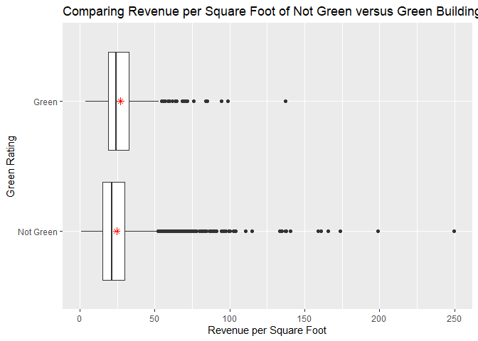
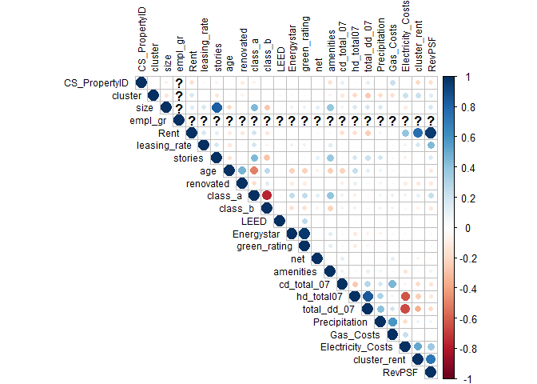
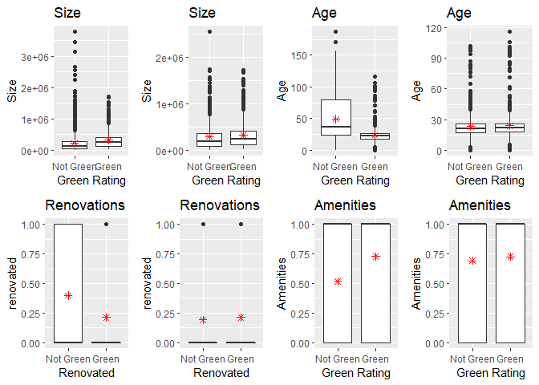
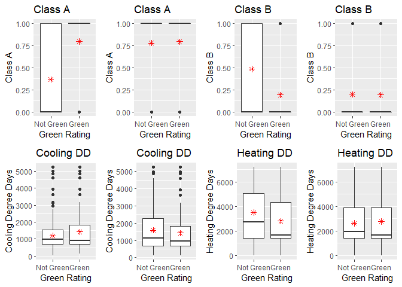
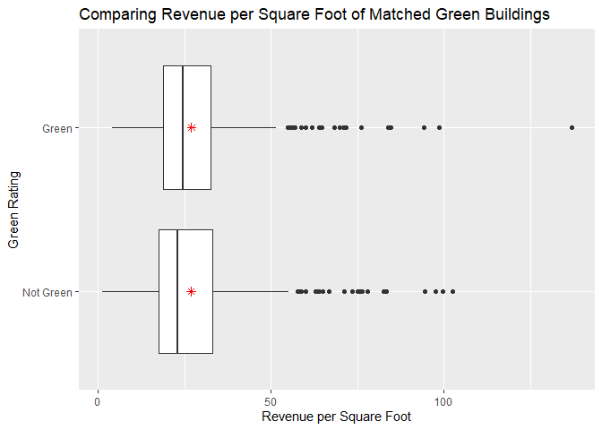
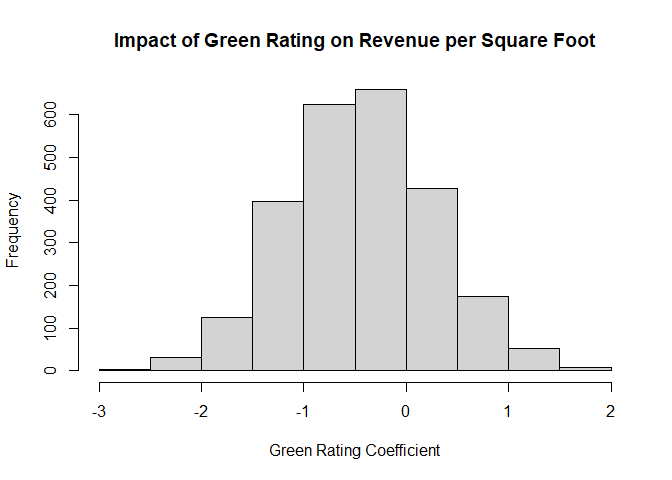

Visual story telling part 1: green buildings
--------------------------------------------

Predicting expected profitability is essential for investments,
especially large capital projects like a $100M 250,000 sq.ft. mixed-use
building. From the initial analysis, it appears that the 5% expected
premium for green certification is a good investment, as costs may be
recovered in less than 8 years.

We see from the graph above that the medians (black lines on the
boxplots) and means (represented by the red stars) of green and
non-green building revenue per square foot are different. The not green
buildings have a mean of $24.50, while the green buildings have a mean
of $27.00. This shows that from both means and medians, there is
additional revenue on average for green buildings.

However, there are a number of issues with the original staff member’s
analysis:

-   The staff member used the median in his analysis rather than the
    mean. While he is correct that the median is more robust to
    outliers, it is important to consider outliers in this analysis.
    Thus, the mean is a better measure of spread for comparing the two
    groups, and the **treatment of outliers** should be considered in
    more detail.

-   Green and non-green buildings are **inherently different.** Green
    buildings are more likely to be newer, bigger, Class A developments.
    Variables like age, size, and class of the building are confounding
    variables that impact both whether or not a building is green and
    its revenue per square foot. Because these building groups have
    confounding variables, we cannot simply compare their means.

-   We must consider the **time value of money.** Performing an NPV
    analysis and talking to the construction company about reducing the
    cost of the project will supplement our analysis.

First, instead of dropping all buildings with leasing rates less than
10%, we chose to drop only those with leasing rates less than 1% to
consider more of the outliers.

**What variables appear to be confounding?**

First, I built a correlation matrix to identify how each of the building
predictors are related.

-   We see that a building’s Green Rating is slightly positively
    correlated with Class A, more desirable buildings and negatively
    correlated with Age.

-   Building Revenue per Square Foot, Rent, and Cluster Rent are all
    positively correlated. This makes sense as buildings with a higher
    rent per square foot should have a higher revenue per square foot.
    Cluster rent and rent tend to be positively correlated as well, as
    buildings will have similar rents to other buildings in their local
    markets.

I then compared boxplots of each of the predictor variables for Not
Green versus Green buildings, and the charts for the predictors that may
be confounding variables are shown below.

-   Green Buildings tend to be **larger in size** and **younger in age**
    on average.

-   Green Buildings are also **less likely to have been renovated** and
    **have more amenities.**

-   Green Buildings are more likely to be **Class A** buildings, the
    highest quality properties, while Not Green Buildings are more
    likely to be the lower **Class B** buildings.

-   Green Buildings more often situated in warmer climates that have
    **higher cooling degree days** and fewer **heating degree days.**

**So, is the increased Revenue Per Square Foot in Green buildings
*really* due to their Green Rating?** Or, instead, is it because they
are newer, larger, more desirable buildings that just happen to be green
certified? To answer this question, we must “adjust” for these
confounding variables in order to compare buildings where the *only
difference* is a green certification.

Theoretically, to answer this developer’s question about the economic
impact of “going green,” we’d like to have two identical 250,000 square
foot buildings on East Cesar Chavez: one Green Rated and one Not Green
Rated. Only then could we assess whether the 5% expected premium for
green certification would hold true. However, we can’t do this in East
Austin. Instead, we *can* **match our data in order to balance the green
and non-green building groups.**

The goal of our analysis is to adjust for those 8 confounding variables
described above like age, size, and class. The matching process entails:

-   For each green building, finding a non-green building that is very
    similar in confounding variables. For example, they have similar
    ages, stories, and amenities.

-   Pairing the data up into a new dataset so each green building has a
    “matched” non-green building.

The output below shows the summary of the matched and unmatched
datasets.

    ## 
    ## Call:
    ## matchit(formula = green_rating ~ size + age + class_a + class_b + 
    ##     renovated + amenities + cd_total_07 + hd_total07, data = green_cl)
    ## 
    ## Summary of balance for all data:
    ##             Means Treated Means Control  SD Control  Mean Diff     eQQ Med
    ## distance           0.1742        0.0803      0.0825     0.0939      0.0993
    ## size          326286.8171   230299.3257 299437.1103 95987.4914 107554.5000
    ## age               23.9336       49.1663     32.3225   -25.2327     14.0000
    ## class_a            0.7965        0.3680      0.4823     0.4285      0.0000
    ## class_b            0.1932        0.4854      0.4998    -0.2922      0.0000
    ## renovated          0.2139        0.3971      0.4893    -0.1832      0.0000
    ## amenities          0.7271        0.5173      0.4997     0.2098      0.0000
    ## cd_total_07     1427.6844     1202.1522   1089.0898   225.5321    134.0000
    ## hd_total07      2768.6932     3479.6950   1970.0977  -711.0017    668.0000
    ##                eQQ Mean      eQQ Max
    ## distance         0.0939       0.1399
    ## size        102480.9749 2059803.0000
    ## age             25.2861      63.0000
    ## class_a          0.4277       1.0000
    ## class_b          0.2920       1.0000
    ## renovated        0.1829       1.0000
    ## amenities        0.2094       1.0000
    ## cd_total_07    243.5118    1482.0000
    ## hd_total07     711.9159    2044.0000
    ## 
    ## 
    ## Summary of balance for matched data:
    ##             Means Treated Means Control  SD Control  Mean Diff    eQQ Med
    ## distance           0.1742        0.1741      0.0776     0.0000     0.0001
    ## size          326286.8171   291389.9661 315069.1079 34896.8510 49234.0000
    ## age               23.9336       23.2021     14.7229     0.7316     0.0000
    ## class_a            0.7965        0.7802      0.4144     0.0162     0.0000
    ## class_b            0.1932        0.1991      0.3996    -0.0059     0.0000
    ## renovated          0.2139        0.1917      0.3940     0.0221     0.0000
    ## amenities          0.7271        0.6917      0.4621     0.0354     0.0000
    ## cd_total_07     1427.6844     1584.8245   1323.9999  -157.1401     0.0000
    ## hd_total07      2768.6932     2623.4366   1754.1965   145.2566     0.0000
    ##               eQQ Mean     eQQ Max
    ## distance        0.0002      0.0026
    ## size        47369.8215 828758.0000
    ## age             0.8968     20.0000
    ## class_a         0.0162      1.0000
    ## class_b         0.0059      1.0000
    ## renovated       0.0221      1.0000
    ## amenities       0.0354      1.0000
    ## cd_total_07   158.9985   1696.0000
    ## hd_total07    172.6106   1183.0000
    ## 
    ## Percent Balance Improvement:
    ##             Mean Diff.  eQQ Med eQQ Mean  eQQ Max
    ## distance       99.9803  99.9367  99.8336  98.1680
    ## size           63.6444  54.2241  53.7770  59.7652
    ## age            97.1007 100.0000  96.4536  68.2540
    ## class_a        96.2136   0.0000  96.2069   0.0000
    ## class_b        97.9807   0.0000  97.9798   0.0000
    ## renovated      87.9244   0.0000  87.9032   0.0000
    ## amenities      83.1271   0.0000  83.0986   0.0000
    ## cd_total_07    30.3247 100.0000  34.7060 -14.4399
    ## hd_total07     79.5701 100.0000  75.7541  42.1233
    ## 
    ## Sample sizes:
    ##           Control Treated
    ## All          6976     678
    ## Matched       678     678
    ## Unmatched    6298       0
    ## Discarded       0       0

The graphs below represent the compared boxplots of the data *before*
matching and the data *after* matching. Each left graph is before
matching, and each graph on the right shows the difference in the
matched data. There is now much smaller difference in confounding
variables.

Balancing the data allows me to compare like with like. This eliminates
the effect of the confounding variables because now the confounders are
equal between the two different groups. It is now reasonable to compare
the Revenue per Square Foot of Green and Non-Green buildings and make a
conclusion about the impact of green rating because green rating is the
only thing that is different between the two groups.

This is a better approach because we know that green rating is the only
variable that is impacting differences in revenue per square foot. In
the first situation, the differences in groups could have been caused by
a number of confounding variables.

**Now that we’ve adjusted for confounding variables, the differences in
mean revenue in the matched groups are smaller.** The mean revenue per
square foot of the **non-green matched buildings is $26.24**, while the
**mean of the green buildings is $26.97**, resulting in a difference of
**$0.73** per square foot. This is much smaller than original estimate
of $2.60 increased revenue per square foot. This would translate into an
additional 250,000 \* 0.73 = $182,500 of extra revenue per year. If the
expected baseline construction costs are $100 million, with an expected
5% premium for green certification, that means we should expect to spend
an extra $5 million on the green building. It would take
5,000,000/182,500 = 27.4 years to recuperate the costs, without
accounting for the time value of money. **This does not seem like a good
financial move to build the green building; it is much riskier than the
original estimate.**

**Next, we need to estimate how “stable” our estimate of $0.77 increased
revenue per square foot of a green building is.** We ran a bootstrapped
linear model to understand how the coefficient for **green rating**
changes as we resample with replacement. The histogram of these
coefficients is shown below, and the 95% confidence interval for the
coefficient for green rating is -$1.18 to +$1.91 with a mean of $0.46
per square foot.

From the bootstrapped regression, our estimate for the coefficient of
green rating falls again, and we are not sure that it is greater than 0,
as 0 is included in the confidence interval. This shows that there’s
**no significant difference** in rental revenue between green and
not-green buildings, and the green construction certification is not a
profitable investment.

The upper 95% confidence interval is $1.91 Revenue per Square Foot.
Assuming a lift at the 95% coefficient level, 6% discount rate, and 90%
leasing rate for the next 30 years, the NPV of this investment is
$915,436.

Assuming the mean coefficient of $0.46, 6% discount rate, and 90%
leasing rate for the next 30 years, the **NPV of this investment is
-$3,575,340.** This negative NPV shows that this is not a profitable
investment, and **the $5,000,000 could be better spent on more
development space or amenities that may be more likely to increase
revenue per square foot.**

Visual story telling part 2: flights at ABIA
--------------------------------------------

Portfolio Modeling
------------------

Market segmentation
-------------------

Author attribution
------------------

Association rule mining
-----------------------
