Visual story telling part 1: green buildings
--------------------------------------------

Predicting expected profitability is essential for investments,
especially large capital projects like a $100M 250,000 sq.ft. mixed-use
building. From the initial analysis, it appears that the 5% expected
premium for green certification is a good investment, as costs may be
recovered in less than 8 years.

We see from the graph above that the medians (on the boxplots) and means
(represented by the red stars) of green and non-green building revenue
per square foot are different. The not green buildings have a mean of
$24.50, while the green buildings have a mean of $27.00. This shows that
from both means and medians, there is additional revenue on average for
green buildings.

However, there are a number of issues with the original staff member’s
analysis:

-   The staff member used the median in his analysis rather than the
    mean. While he is correct that the median is more robust to
    outliers, it is important to consider outliers in this analysis.
    Thus, the mean is a better measure of spread for comparing the two
    groups, and the **treatment of outliers** should be considered in
    more detail.

-   Green and non-green buildings are **inherently different.** Green
    buildings are more likely to be newer, bigger, Class A developments.
    Variables like age, size, and class of the building are confounding
    variables that impact both whether or not a building is green and
    its revenue per square foot. Because these building groups have
    confounding variables, we cannot simply compare their means.

-   We must consider the **time value of money.** Performing an NPV
    analysis and talking to the construction company about reducing the
    cost of the project will supplement the analysis.

First, instead of dropping all buildings with leasing rates less than
10%, I chose to drop only those with leasing rates less than 1% to
consider more of the outliers.

**What variables appear to be confounding?**

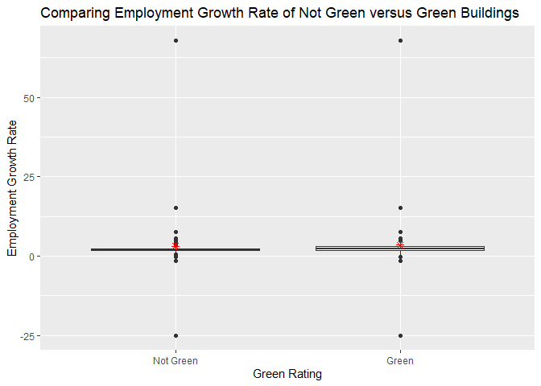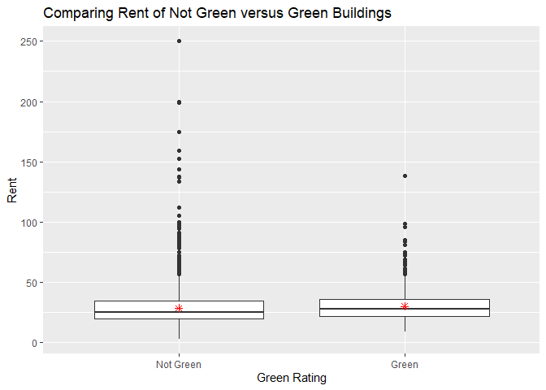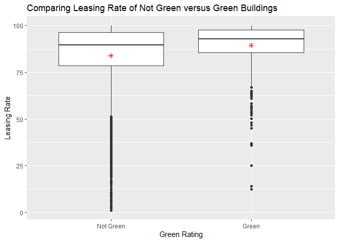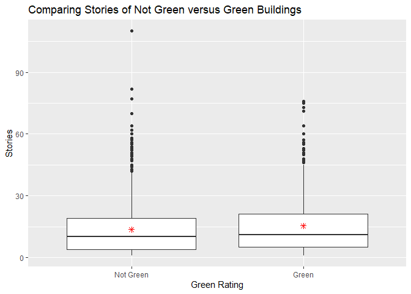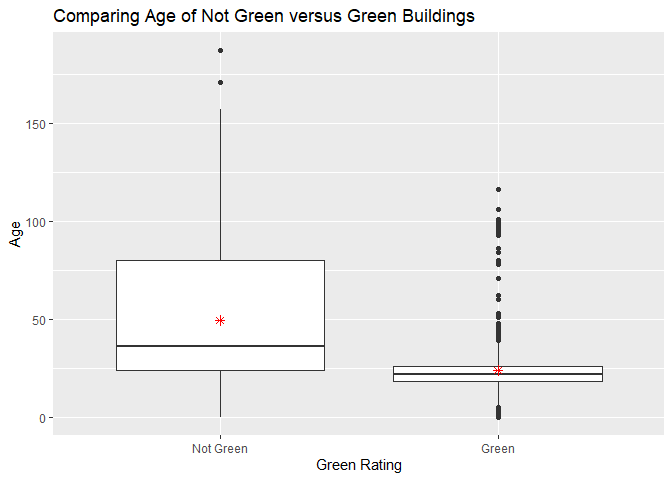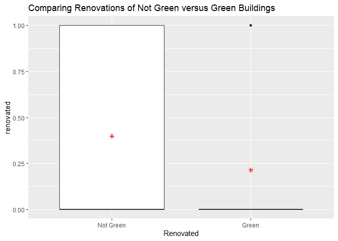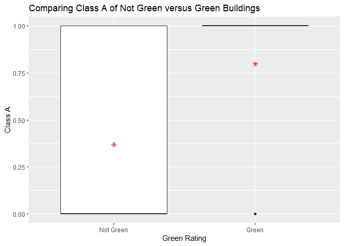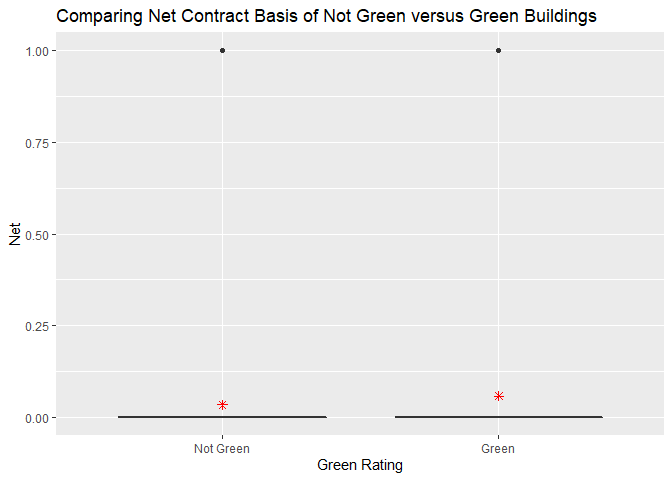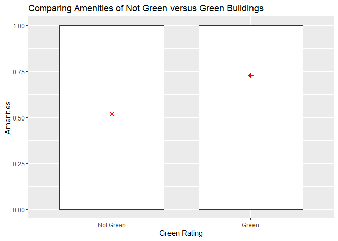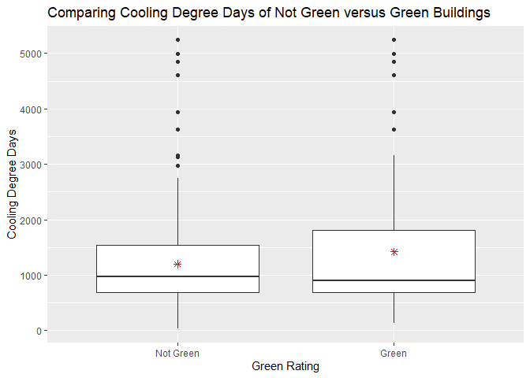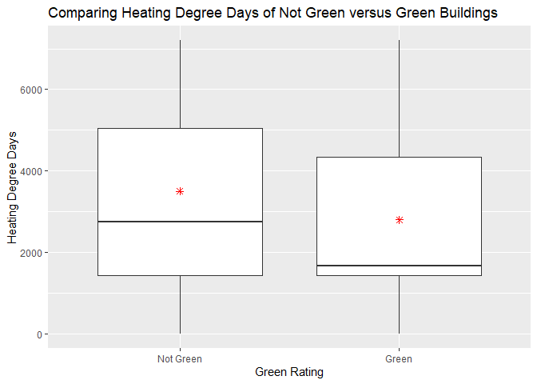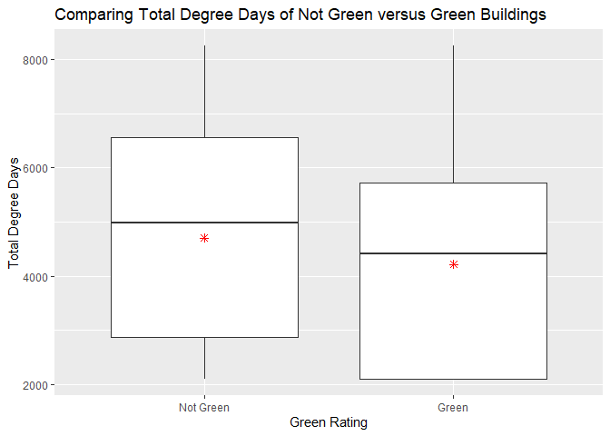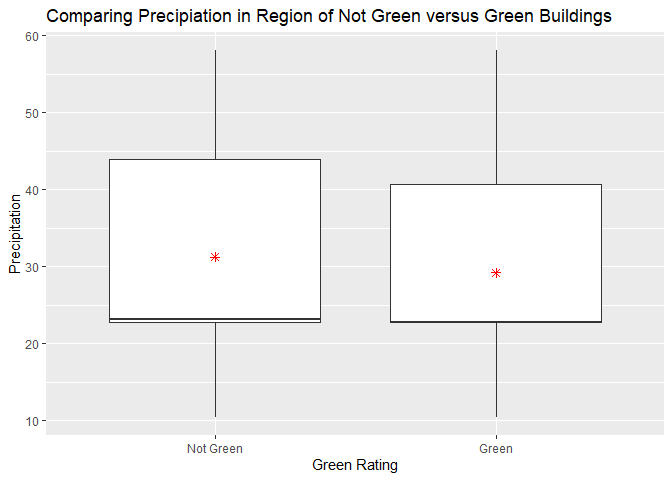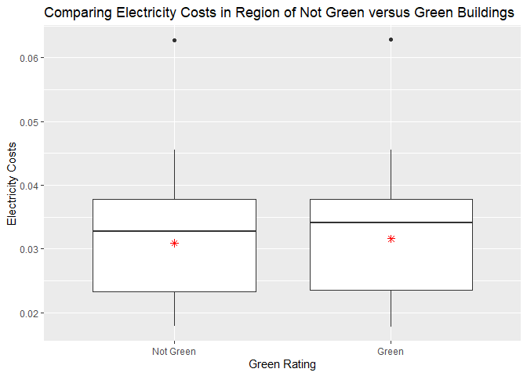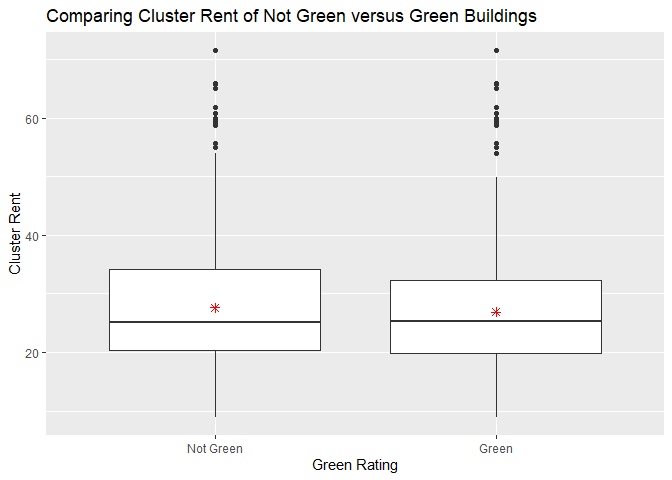

Visual story telling part 2: flights at ABIA
--------------------------------------------

Portfolio Modeling
------------------

Market segmentation
-------------------

Author attribution
------------------

Association rule mining
-----------------------
